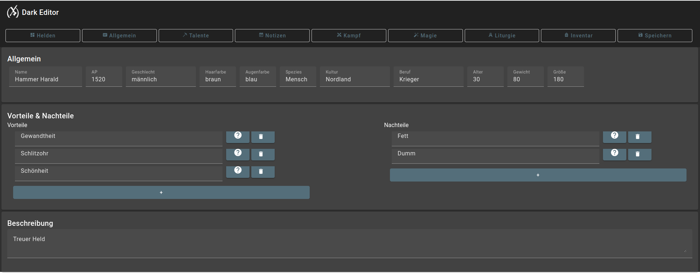

# DsaEditor

This is an Angular project, starting with version 15, now on version 20.
It is a web application for editing and viewing our Heroes from ["Das schwarze Auge"](https://de.wikipedia.org/wiki/Das_Schwarze_Auge).
Here is an example screen of the App.

Right now its open-source but closed community, if you want to join us, please contact me.

Its hosted on Google Firebase and backed by Google Firestore Database.

## Development server

Run `ng serve` for a dev server. Navigate to `http://localhost:4200/`. The application will automatically reload if you change any of the source files.

## Code scaffolding

Run `ng generate component component-name` to generate a new component. You can also use `ng generate directive|pipe|service|class|guard|interface|enum|module`.

## Build

Run `ng build` to build the project. The build artifacts will be stored in the `dist/` directory.

## Further help

To get more help on the Angular CLI use `ng help` or go check out the [Angular CLI Overview and Command Reference](https://angular.io/cli) page.

## Deployment

First build the project. Then run `firebase deploy`.

